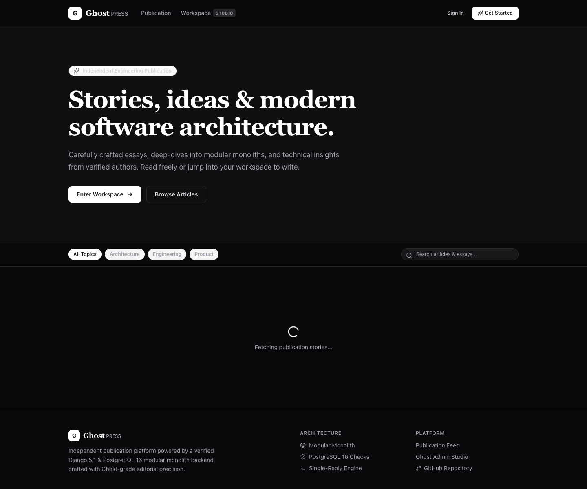
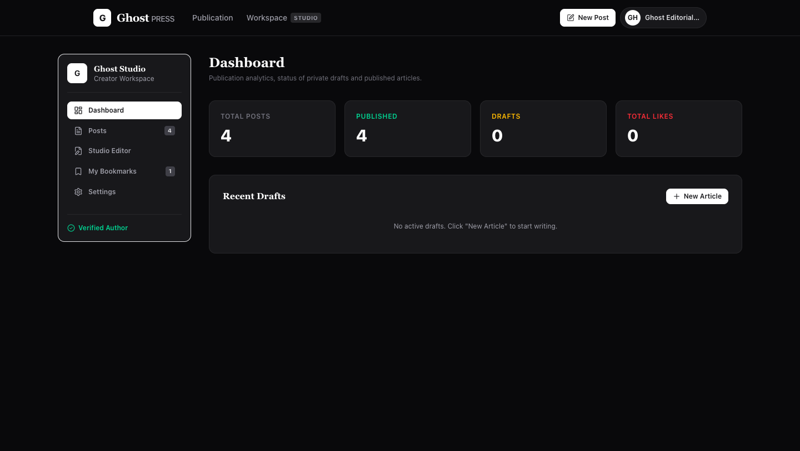
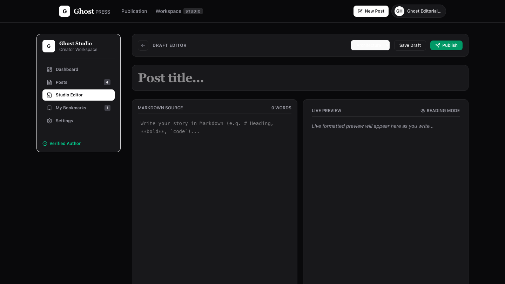
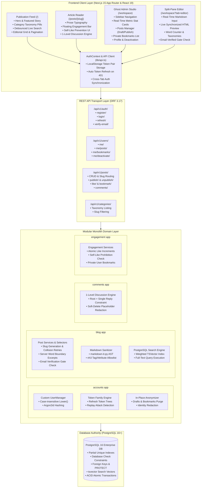
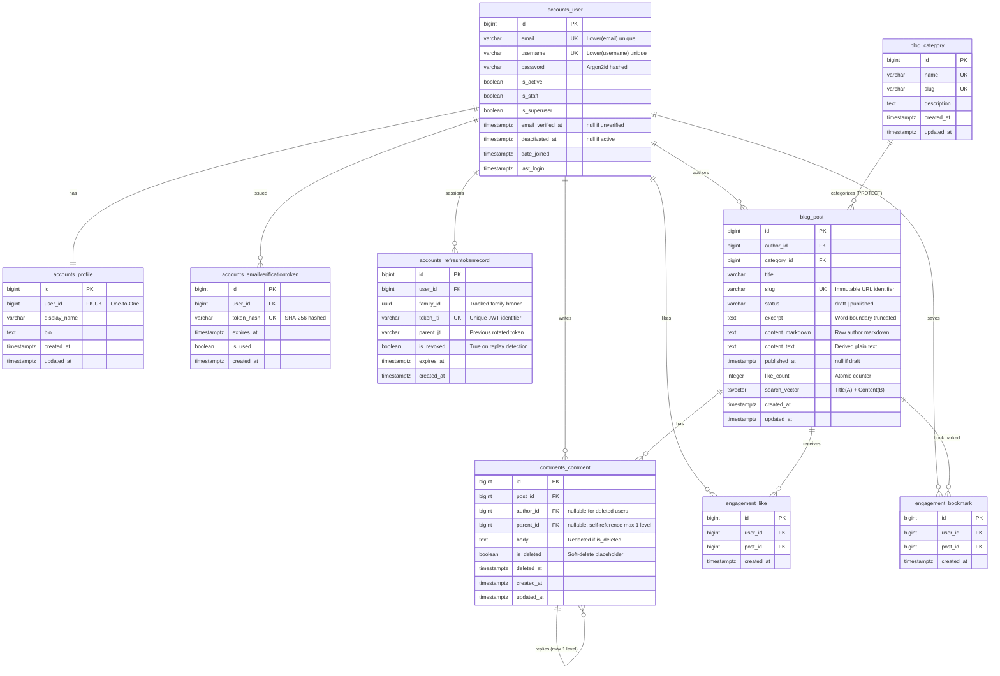

# Blog Management Platform (REST API)

A robust, production-grade, multi-author Blog Management Platform built with **Django 5.1**, **Django REST Framework 3.17**, and **PostgreSQL 16+**.

The platform is engineered as a **Modular Monolith** adhering to strict architectural boundaries, explicit service and selector layers, automated quality controls, and database-level integrity guards.

[](https://github.com/Humpty94/Blog_Management_system/actions/workflows/ci.yml)
[](https://www.python.org/downloads/)
[](https://www.djangoproject.com/)
[](https://www.postgresql.org/)
[](https://nextjs.org/)
[](https://tailwindcss.com/)
[](https://github.com/astral-sh/ruff)
[]()

---

## Application Showcase (Ghost-Inspired Interface)

GhostPRESS pairs high-contrast editorial minimalism with a distraction-free creator studio.

### 1. Publication Landing Page
> Editorial hero header, dynamic category taxonomy pills, real-time debounced search, featured story card, and responsive publication feed.



### 2. Distraction-Free Article Reader
> Long-form prose typography, author byline, floating engagement bar (likes, private bookmarks, sharing), and 1-level threaded discussion engine.


### 3. Ghost Admin Creator Studio (Dashboard Analytics)
> Ghost Admin sidebar, real-time metrics cards (Total Articles, Published, Active Drafts, Reader Likes), and recent drafts manager.



### 4. Split-Pane Markdown Editor with Live Preview
> Distraction-free authoring with live character/word counters, synchronized HTML rendering, category selector, and email-verification publishing gates.



---

## End-to-End System Architecture

The system is architected as an asynchronous single-page frontend consuming a strictly modular Django 5.1 backend:



---

## Relational Database Schema (ER Diagram)

All domain rules and business invariants are enforced as the final authority in PostgreSQL via constraints, foreign keys, and partial indexes:



---

## Tech Stack

| Component | Technology | Rationale |
|---|---|---|
| **Language** | Python 3.12+ | Modern syntax and runtime performance |
| **Framework** | Django 5.1 LTS | Robust ORM, migrations, and battle-tested security |
| **API Layer** | Django REST Framework 3.17 | Declarative serializers, viewsets, and throttles |
| **Database** | PostgreSQL 16+ via `psycopg` 3 | Check constraints, partial indexes, Full-Text Search |
| **Auth & Tokens** | `argon2-cffi` + `simplejwt` | Argon2id password hashing + custom refresh token family tracking |
| **Markdown** | `markdown-it-py` + `nh3` | Defense-in-depth HTML sanitization |
| **Frontend** | Next.js 15 + TypeScript + Tailwind CSS | Ghost-inspired publication & creator studio |
| **Icons** | `lucide-react` | Clean editorial iconography |
| **API Contract** | `drf-spectacular` | OpenAPI 3.0 schema generation |
| **Code Quality** | `ruff`, `pytest`, `pytest-cov`, ESLint | Fast linting, formatting, and high-coverage testing |

---

## Quickstart & Local Setup

### Prerequisites
- Python 3.12+
- Node.js 20+ & npm 10+
- PostgreSQL 16+ running on `127.0.0.1:5432`

### 1. Clone & Set Up Backend Virtual Environment

```bash
git clone https://github.com/Humpty94/Blog_Management_system.git
cd Blog_Management_system

python3 -m venv .venv
source .venv/bin/activate
pip install -r requirements-dev.txt
```

### 2. Configure Backend Environment

Copy the example environment configuration:

```bash
cp .env.example .env
```

Ensure your PostgreSQL service is running and create the databases:

```sql
CREATE DATABASE blog_db;
CREATE DATABASE test_blog_db;
```

### 3. Run Migrations & Seed Data

```bash
python manage.py migrate
python manage.py createsuperuser
```

### 4. Start Backend Server

```bash
python manage.py runserver
```

The Django REST API is accessible at `http://127.0.0.1:8000/api/v1/`.

### 5. Start Frontend (Ghost-inspired Publication & Studio)

In a separate terminal:

```bash
cd frontend
cp .env.example .env.local
npm install
npm run dev
```

The Ghost publication is accessible at `http://localhost:3000`:
- **Landing Page (`/`)**: Ghost hero header, category filter pills, live debounced search, featured post, and editorial grid.
- **Article Reader (`/posts/[slug]`)**: Editorial prose typography, live like/bookmark toggles with self-like protection, and 1-level discussion engine with soft-deletion placeholders.
- **Ghost Admin Studio (`/workspace`)**: Sidebar navigation, metrics dashboard, post table with draft/published status badges, distraction-free split-pane Markdown editor with live preview, private bookmarks, and profile/security settings.

---

## Testing & Quality Assurance

### Run the Test Suite with Coverage

```bash
pytest --cov --cov-fail-under=85
```

*119 unit and integration tests passing with 93.8% code coverage.*

### Code Style & Linting

```bash
ruff check .
ruff format --check .
```

### Validate OpenAPI 3 Contract

```bash
python manage.py spectacular --validate --fail-on-warn
```

### Production Deployment Check

```bash
DJANGO_SETTINGS_MODULE=config.settings.prod python manage.py check --deploy
```

---

## API Catalog (`/api/v1/`)

### Authentication & Identity (`accounts`)
| Method | Endpoint | Description |
|---|---|---|
| `POST` | `/api/v1/auth/register/` | Register new user account |
| `POST` | `/api/v1/auth/login/` | Authenticate and issue JWT token pair |
| `POST` | `/api/v1/auth/verify-email/` | Verify email with single-use token |
| `POST` | `/api/v1/auth/resend-verification/` | Resend verification token email |
| `POST` | `/api/v1/auth/refresh/` | Rotate refresh token with reuse detection |
| `POST` | `/api/v1/auth/logout/` | Revoke current refresh token |
| `GET` | `/api/v1/users/me/` | Current user profile |
| `PATCH` | `/api/v1/users/me/` | Update profile (display name, bio) |
| `POST` | `/api/v1/users/me/deactivate/` | Deactivate & irreversibly anonymize account |
| `GET` | `/api/v1/users/<username>/` | Public user profile |

### Content & Taxonomy (`blog`)
| Method | Endpoint | Description |
|---|---|---|
| `GET` | `/api/v1/categories/` | List all categories |
| `GET` | `/api/v1/categories/<slug>/` | Category details |
| `GET` | `/api/v1/posts/` | Browse published posts (filters: `category`, `search`, `ordering`) |
| `POST` | `/api/v1/posts/` | Create a new draft post |
| `GET` | `/api/v1/posts/<slug>/` | Post details (sanitized HTML, excerpt, author) |
| `PATCH` | `/api/v1/posts/<slug>/` | Update post (title, content, category) |
| `DELETE` | `/api/v1/posts/<slug>/` | Delete post |
| `POST` | `/api/v1/posts/<slug>/publish/` | Publish post (verified email required) |
| `POST` | `/api/v1/posts/<slug>/unpublish/` | Revert post to draft |
| `GET` | `/api/v1/users/me/posts/` | List own posts (drafts and published) |
| `GET` | `/api/v1/users/<username>/posts/` | List author's public published posts |

### Comments & Discussions (`comments`)
| Method | Endpoint | Description |
|---|---|---|
| `GET` | `/api/v1/posts/<slug>/comments/` | List comments and nested replies for post |
| `POST` | `/api/v1/posts/<slug>/comments/` | Create root comment or 1-level reply |
| `DELETE` | `/api/v1/comments/<id>/` | Delete comment (placeholder if replies exist) |

### Reader Engagement (`engagement`)
| Method | Endpoint | Description |
|---|---|---|
| `POST` | `/api/v1/posts/<slug>/like/` | Idempotent post like toggle |
| `DELETE` | `/api/v1/posts/<slug>/like/` | Idempotent post unlike |
| `POST` | `/api/v1/posts/<slug>/bookmark/` | Idempotent bookmark post |
| `DELETE` | `/api/v1/posts/<slug>/bookmark/` | Idempotent remove bookmark |
| `GET` | `/api/v1/users/me/bookmarks/` | List current user's private bookmarks |

### Operational
| Method | Endpoint | Description |
|---|---|---|
| `GET` | `/api/v1/health/` | Service & database health check |

---

## Core Invariants Enforced

1. **Strict Draft Privacy**: Unpublished posts return `404 Not Found` to non-authors and anonymous viewers.
2. **Verified-Email Publishing Gate**: An author cannot transition a post to `published` without a verified email address.
3. **One-Reply-Level Constraint**: Comments support exactly root comments and direct replies. Nested replies to replies are rejected (`400 Bad Request`).
4. **Placeholder Deletions**: Deleting a root comment with replies sets `is_deleted=True`, blanks the body, and redacts the author (`[This comment has been deleted]`), preserving replies. Standalone comments and replies are hard-deleted.
5. **Self-Like Prohibition**: Authors cannot like their own posts (`self_like_prohibited`).
6. **Private Bookmarks**: Bookmarks are strictly private to the user who created them.
7. **Idempotency**: Like and bookmark toggles are safe against concurrent and duplicate calls.
8. **Token Reuse Detection**: Attempting to replay an already-rotated refresh token instantly revokes all active tokens in that family.
9. **Category Deletion Protection**: Categories with posts cannot be deleted (`PROTECT`). Posts must be reassigned first via Django Admin.
